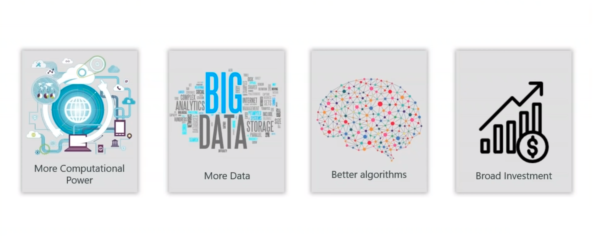
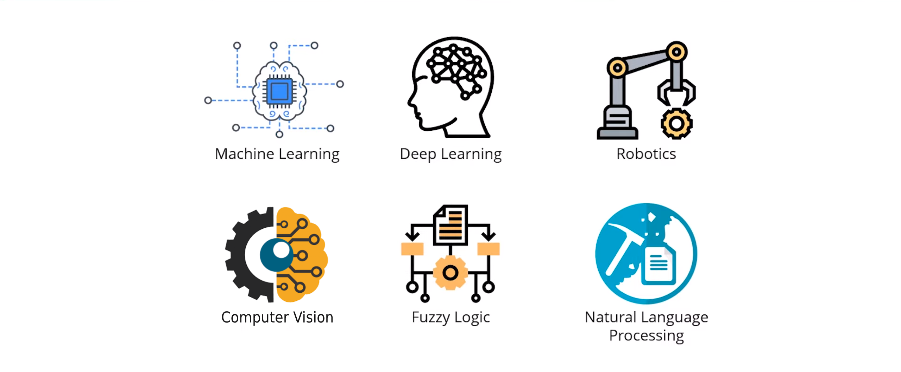
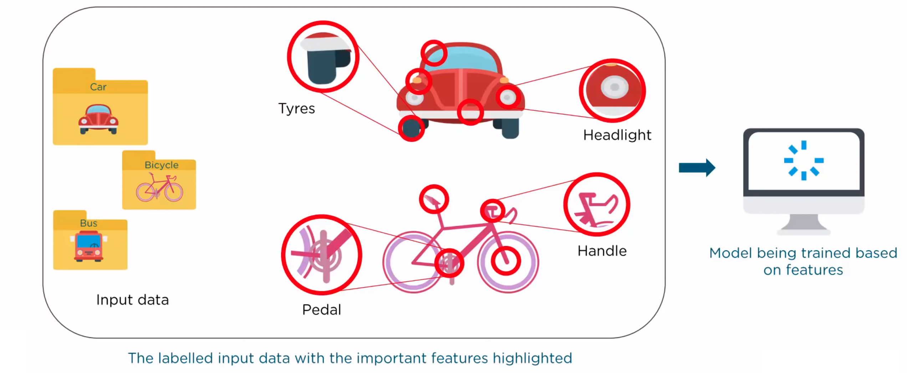
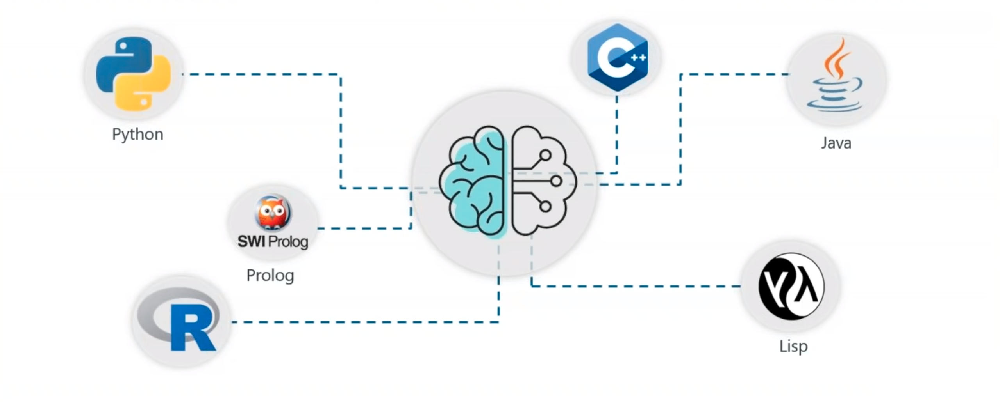

class: middle, center, title-slide

# Introduction to Artificial Intelligence

Lecture 0: Artificial Intelligence

  
Kaleab A. Kinfu 
[kinfu@jhu.edu](mailto:kinfu@jhu.edu)

???

R: https://hai.stanford.edu/sites/default/files/2020-09/AI-Definitions-HAI.pdf

---

# Today

- Course outline
- Introduction to Artificial Intelligence
- Highlight AI Researcher

---

# Outline

- Lecture 0: Artificial intelligence
- Lecture 1: Machine Learning 
- Lecture 2: Deep Learning 
- Lecture 3: Project: Geez Digit Recognizer 
---

class: middle

## Goal

By the end of this workshop, you will have built a Ge'ez digit recognition system using a Deep-Learning technique. 

The ML techniques you will see in this workshop apply to a wide variety of artificial intelligence problems and will serve as the foundation for further study in any application area you choose to pursue.

.width-60.center[]

---

class: middle

.width-30.circle.center[]
.center[.bold[Kaleab Alemayehu Kinfu]]  
.italic[**Ph.D. student** at the **Johns Hopkins University.**]  
*M.S.E*, .italic[Biomedical Engineering], *Johns Hopkins University.*  
*M.Sc*, .italic[Informatique], *University of Bordeaux.*  
*M.Sc*, .italic[Image Processing and Computer Vision], *Autonomous University of Madrid.* 
*M.Sc*, .italic[Computer Science Engineering], *Pazmany Peter Catholic University.* 
*B.Sc*, .italic[Computer Science], *Addis Ababa University.* 
 
*Mentor*, .italic[Emerging African Scholars Mentorship Program.]  
*Mentor*, .italic[Young African Explorers Programme.]

???
---

class: middle

# Artificial intelligence
<!--  -->
.center[
<video width="500" height="500" controls>
  <source src="figures/lec0/Intro_Video.mp4" type="video/mp4">
</video>
]
---

class: middle

.width-45[]&nbsp;&nbsp;&nbsp;
.width-45[]  
.width-45[]&nbsp;&nbsp;&nbsp;
.width-45[]

---

class: middle, center

.width-50[]

"With artificial intelligence we are summoning the demon" -- Elon Musk

.width-45[]&nbsp;&nbsp;&nbsp;
.width-50[]

Triggers a rich imagination fueled by science-fiction.

---

class: middle, center
.width-40[]&nbsp;&nbsp;&nbsp;
.width-55[]

"We're really closer to a smart washing machine than Terminator. If you look at today's AI, we're really very nascent. I am really excited and passionate about AI's potential." -- Fei-Fei Li, Director of Stanford AI Lab.

???

The reality is quite different...

---

class: middle

.center[

.width-25.circle[]&nbsp;&nbsp;&nbsp;
.width-25.circle[]

]

Edsger Dijkstra: .italic[What do you work on?] 
Leslie Valiant (very proudly): .italic[Artificial Intelligence.] 
Edsger Dijkstra: .italic[Why don't you work first on the .bold["Intelligence"] part?]

???

Before trying to define the contours of artificial intelligence, let us first reflect on the these words.

-> No more "artificial"

---

class: middle

.width-30.circle.center[]

.italic[".bold[What is intelligence, anyway?] It is only a word that people use to name those unknown processes with which our brains
solve problems we call hard. But whenever you learn a skill yourself, you're less impressed or mystified when other people
do the same.

This is why .bold[the meaning of "intelligence" seems so elusive]: it describes not some definite thing but only the
momentary horizon of .bold[our ignorance about how minds might work]. It is hard for scientists who try to understand intelligence
to explain precisely what they do, since our working definitions change from year to year. But it is not at all unusual for
sciences to aim at moving targets." -- Marvin Minsky]

???

-> No more "intelligence"

---

class: middle
.slide_left.width-110[]
---

# A definition?

Artificial intelligence is the science of making machines or programs that:
.center.grid[
.kol-1-4[]
.kol-1-4[
.caption[Think like people]
.width-100[]
]
.kol-1-4[
.caption[Think rationally]
.width-100[]]
]
.grid[
.kol-1-4[]
.kol-1-4[
.caption[Act like people]
.width-100[]
]
.kol-1-4[
.caption[Act rationally]
.width-100[]
]
]

.footnote[Image credits: [CS188](https://inst.eecs.berkeley.edu/~cs188/), UC Berkeley.]

???

Textbook definition(s) from AIMA.
---
class: middle
.slide_left.width-110[]
---
class: middle
# History of AI
.slide_left.width-110[]
---
class: middle
# History of AI
.slide_left.width-110[]
---
class: middle
# History of AI
.slide_left.width-110[]
---
class: middle
# History of AI
.slide_left.width-110[]
---
class: middle
# History of AI
.slide_left.width-110[]
---
class: middle
# History of AI
.slide_left.width-110[]
---
class: middle
# History of AI
.slide_left.width-110[]
---
class: middle
# History of AI
.slide_left.width-110[]
---
class: middle
# History of AI
.slide_left.width-110[]
---
class: middle
# History of AI
.slide_left.width-110[]

---
class: middle
# Types of AI
.slide_left.width-110[]
---
class: middle
# Types of AI
.slide_left.width-110[]
---
class: middle
# Types of AI
.slide_left.width-110[]
---
class: middle
# Demand for AI
.slide_left.width-110[]
---
class: middle, center
# Why should you care?

.width-80[]

---
class: middle
# Domains of AI
.slide_left.width-110[]

---

class: middle
# Machine Learning

.center[
.width-40[] &nbsp; &nbsp;
.width-40[]
]

.exercise[How would you write a computer program that recognizes cats from dogs?]

---

class: middle

.center.width-60[]

---

count: false
class: black-slide, middle

.center.width-50[]

.center[The good old-fashioned approach.]

---

count: false
class: black-slide, middle

.center.width-80[]

---

count: false
class: black-slide, middle

.center.width-80[]

---

class: middle

.center.width-100[]

.center[The deep learning approach.]

---
class: middle
# Machine Learning
.slide_left.width-110[]
---
class: middle
# Machine Learning
.slide_left.width-110[]
---
class: middle
# Need for Machine Learning
.slide_left.width-110[]
---
class: middle
# Need for Machine Learning
.slide_left.width-110[]
---
class: middle
# Programming Languages for AI
.slide_left.width-110[]

---
# What can AI do at present?

- Translate spoken Chinese to spoken English, live?
- Answer multi choice questions, as good as an 8th grader?
- Converse with a person for an hour?
- Play decently at Chess? Go? Poker? Soccer?
- Buy groceries on the web? in a supermarket?
- Prove mathematical theorems?
- Drive a car safely on a parking lot? in New York?
- Perform a surgery?
- Identify skin cancer better than a dermatologist?
- Write a funny story?
- Paint like Vangogh? Compose music?
- Show common sense?

---

class: middle, center, black-slide

<iframe width="600" height="450" src="https://www.youtube.com/embed/Nu-nlQqFCKg" frameborder="0" allowfullscreen></iframe>

Speech translation and synthesis (2012)

---

class: middle, center, black-slide

<iframe width="600" height="450" src="https://www.youtube.com/embed/7gh6_U7Nfjs" frameborder="0" allowfullscreen></iframe>

Speech synthesis and question answering (Google, 2018)

---

class: middle, center, black-slide

<iframe width="600" height="450" src="https://www.youtube.com/embed/V1eYniJ0Rnk" frameborder="0" allowfullscreen></iframe>

Playing Atari games

---

class: middle, center, black-slide

<iframe width="600" height="450" src="https://www.youtube.com/embed/g-dKXOlsf98" frameborder="0" allowfullscreen></iframe>

Beat the best human Go players (2016)

---

class: middle, center, black-slide

<iframe width="600" height="450" src="https://www.youtube.com/embed/NlpS-DhayQA" frameborder="0" allowfullscreen></iframe>

Solving impactful and challenging problems

---

class: middle, center, black-slide

<iframe width="600" height="450" src="https://www.youtube.com/embed/yyLa6xIK9Qs" frameborder="0" allowfullscreen></iframe>

Playing soccer (2018)

---

class: middle, center, black-slide

<iframe width="600" height="450" src="https://www.youtube.com/embed/V-M5SVta2uw" frameborder="0" allowfullscreen></iframe>

A conversation with GPT-3 (2020)

---
class: middle, center, black-slide

<iframe width="600" height="450" src="https://www.youtube.com/embed/gn4nRCC9TwQ" frameborder="0" allowfullscreen></iframe>

Learning to walk (2017)

???

Single algorithm for learning! Nothing is hardcoded.

Similar to a baby learning to walk.

---

class: middle, center, black-slide

<iframe width="600" height="450" src="https://www.youtube.com/embed/qhUvQiKec2U" frameborder="0" allowfullscreen></iframe>

Driving a car (NVIDIA, 2016)

---

class: middle, center, black-slide

<iframe width="600" height="450" src="https://www.youtube.com/embed/RCahWWOSxaw" frameborder="0" allowfullscreen></iframe>

... and preventing accidents.

---

class: middle, center, black-slide

<iframe width="600" height="450" src="https://www.youtube.com/embed/5kpsZoKjPgQ" frameborder="0" allowfullscreen></iframe>

Object detection, pose estimation, segmentation (2019)

---

class: middle, center, black-slide

<iframe width="600" height="450" src="https://www.youtube.com/embed/8BFzu9m52sc" frameborder="0" allowfullscreen></iframe>

Generating image descriptions (2015)

---

class: middle, center, black-slide

<iframe width="600" height="450" src="https://www.youtube.com/embed/IvmLEq9piJ4" frameborder="0" allowfullscreen></iframe>

Detecting skin cancer (2017)

---

class: middle, center, black-slide

<iframe width="600" height="450" src="https://www.youtube.com/embed/egJ0PTKQp4U?start=223" frameborder="0" allowfullscreen></iframe>

Compose music (NVIDIA, 2017)

---

# What is missing?

Intelligence is not just about **pattern recognition**, which is something most of these works are based on.

It is about *modeling the world*:
- explaining and understanding what we see;
- imagining things we could see but haven't yet;
- problem solving and planning actions to make these things real;
- building new models as we learn more about the world.

---
class: middle
# AI biases
## Who do you think will mostly like commit a crime?
.center[

.width-40[]&nbsp;&nbsp;&nbsp;
.width-40[]
]
---

class: middle
# AI biases
## *Our present racial biases are being coded into the technology of the future :(*.center[
.center[
.width-80[]
]
---
class: middle
# AI biases
## > Twitter's Photo Cropping Algorithm Draws Heat for Possible Racial Bias
.center.width-100[]
---
class: middle
# AI biases
## > Israel Arrests Palestinian Because Facebook Translated 'Good Morning' to 'Attack Them'
.center.width-100[]
---
class: middle
# AI biases
## > Only white babies appear in a search for "babies" on Microsoft search engine Bing.
.center.width-100[]
---
class: middle
# AI biases
## > Google Mistakenly Tags Black People as ‘Gorillas.’
.center.width-100[]
---
class: middle
# AI biases
## > Joy Buolamwini found her computer system recognised the white mask, but not her face.

.center[

.width-65[]&nbsp;&nbsp;&nbsp;
.width-25[]
]
---

class: middle
# AI biases
## Why is this happening?
.center.width-90[]
.footnote[Image credits: [The AI Summit](https://theaisummit.com/)]

---
class: middle
# AI biases
## What is the solution?
### Diversity, equity, and inclusion: "AI lacks intelligence without different voices"
.center.width-100[]

---

class: end-slide, center
count: false

The end.

---

# References

- Turing, Alan M. "Computing machinery and intelligence." Mind 59.236 (1950): 433-460.
- Newell, Allen, and Herbert Simon. "The logic theory machine--A complex information processing system." IRE Transactions on information theory 2.3 (1956): 61-79.
- Chomsky, Noam. "Rules and representations." Behavioral and brain sciences 3.1 (1980): 1-15.
