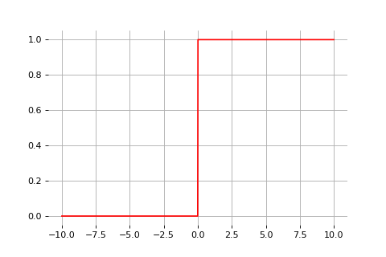
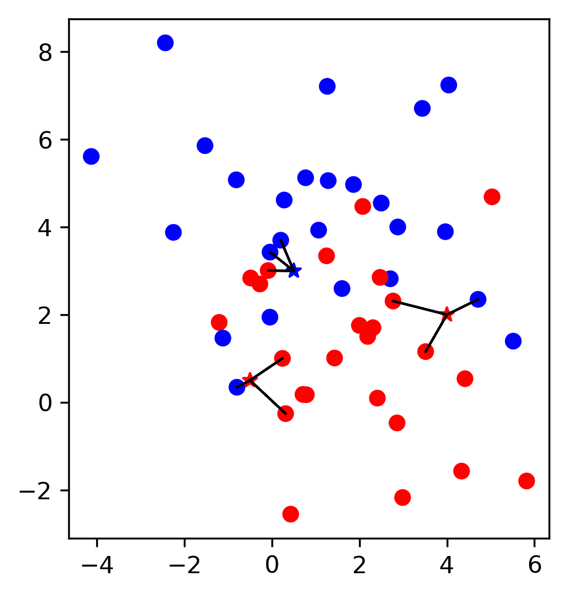
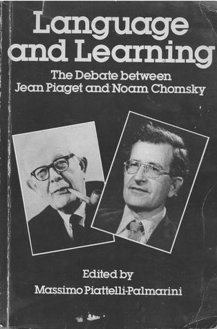

class: middle, center, title-slide

# Introduction to Artificial Intelligence

Lecture 1: Machine Learning

<br><br>
Kaleab A. Kinfu<br>
[kinfu@jhu.edu](mailto:kinfu@jhu.edu)

???

R: develop linear regression / OLS  further ---> up to the analytical solution

---

# Today

.center.width-50[]

Make our agents capable of self-improvement through a **learning** mechanism.
- Machine Learning Problems 
- Machine Learning Process
- Machine Learning Tools 
- Machine Learning Mathematics 
- Machine Learning Resources

.footnote[Image credits: [CS188](https://inst.eecs.berkeley.edu/~cs188/), UC Berkeley.]

---

class: middle

# Machine learning

---

class: middle

.center[
.width-40[] &nbsp; &nbsp;
.width-40[]
]

.exercise[How would you write a computer program that recognizes cats from dogs?]

---

class: middle

.center.width-60[]

---


class: black-slide, middle

.center.width-50[]

.center[The good old-fashioned approach.]

---


class: black-slide, middle

.center.width-80[]

---


class: black-slide, middle

.center.width-80[]

---

class: middle

.center.width-100[]

.center[The deep learning approach.]

---

class: middle
# What is Machine Learning 
<br/>
.slide_left.width-110[]
---
# What is Machine Learning
<br/> 
.slide_left.width-110[]
---
# What is Machine Learning 
<br/>
.slide_left.width-110[]
---
# Machine Learning: Why?
<br/>
<br/>
.slide_left.width-110[]
---
# Programming vs ML
.slide_left.width-110[]
---

# What is Machine Learning

## ML: What is it good for?

- *Problems with longs lists of rules* 
    - when the traditional approach fails, machine learning may help.
- *Continually changing environments* 
    - machine learning can learn and adapt to new scenarios. 
- *Discovering insights within large collections of data* 
    - can you imagine trying to go through every transaction your (large) company has ever had by hand?

---

# What is Machine Learning

## ML: Terminology

- *Algorithms:* 
    - A set of rules and statistical techniques used to learn patters from data.
- *Model:* 
    - A model is what is trained using an ML algorithm.
- *Predictor Variable:* 
    - It is a feature(s) of the data that can be used to predict the output. 
- *Response Variable:* 
    - It is the output variable that needs to be predicted by using the predictor variables.
- *Training Data:* 
    - The data that is used to build the ML model. 
- *Testing Data:* 
    - The data that is used to evaluate the generalization of the trained ML model.   

---
# Machine Learning Process 
<br/>
.slide_left.width-110[]
---
# Machine Learning Process 
<br/>
.slide_left.width-110[]
---
# Machine Learning Process 
<br/>
.slide_left.width-110[]
---
# Machine Learning Process 
<br/>
.slide_left.width-110[]
---
# Machine Learning Process 
<br/>
.slide_left.width-110[]
---
# Machine Learning Process 
<br/>
.slide_left.width-110[]
---
# Machine Learning Process 
<br/>
.slide_left.width-110[]
---
# Machine Learning Process 
<br/>
.slide_left.width-110[]
---
# Types of ML: Categories of Learning
<br/>
.slide_left.width-110[]
---
# Types of ML: Categories of Learning
<br/>
.slide_left.width-110[]
---
# Types of ML: Categories of Learning
<br/>
.slide_left.width-110[]
---
# Types of ML: Categories of Learning
<br/>
.slide_left.width-110[]
---
# Types of ML: Problem Domains
<br/>
.slide_left.width-110[]
---
# Types of ML: Problem Domains
<br/>
.slide_left.width-110[]
---
# Types of ML: Problem Domains
<br/>
.slide_left.width-110[]
---
# Types of ML: Problem Domains
<br/>
.slide_left.width-110[]

---

# Problem statement

Let us assume data $\mathbf{d} \sim p(\mathbf{x}, y)$ of $N$ example input-output pairs
    $$\mathbf{d} = \\\{ (\mathbf{x}\_1, y\_1), (\mathbf{x}\_2, y\_2), ..., (\mathbf{x}\_N, y\_N) \\\},$$
where
$\mathbf{x}\_i$ are the input data and
$y_i$ was generated by an unknown function $y\_i=f(\mathbf{x}\_i)$.

From this data, we want to find a function $h \in \mathcal{H}$ that approximates the true function $f$.

???

$\mathcal{H}$ is huge! How do we find a good hypothesis?

---

class: middle

.center.width-10[]

In general, $f$ will be **stochastic**. In this case, $y$ is not strictly a function $x$, and we wish to learn the conditional $p(y|\mathbf{x})$.

Most of supervised learning is actually (approximate) maximum likelihood estimation on (huge) parametric models.

---

class: middle

## Feature vectors

- Input samples $\mathbf{x} \in \mathbb{R}^d$ are described as real-valued vectors of $d$ attributes or features values.
- If the data is not originally expressed as real-valued vectors, then it needs to be prepared and transformed to this format.
.center.width-90[]

.footnote[Image credits: [CS188](https://inst.eecs.berkeley.edu/~cs188/), UC Berkeley.]

---

class: center

# ML Tools: scikit-learn

.slide_left.width-110[]

<a href="http://scikit-learn.org/" style="color:black; font-size:50px; text-decoration:None" >scikit-learn.org</a>

---

# Representing Data

<br>
.center.width-100[]

---
class: center

# Training and Test Data

<br>
.center.width-80[]

---
class: center, middle

# Notebook: Data Loading

---

# Linear Models

## For classification and regression.

- Simple models, easy to understand and fast to train.

- Linear models are easy to understand and fast to train.
    - They are typically good baselines.

We will cover intuitions on how they work in a machine learning 
settings.
* For regression: linear regression
* For classification: logistic regression
* Non linearly separable data

---
# Linear Regression
## An example: estimating housing prices

| &nbsp;&nbsp;&nbsp; Gr_Liv_Area &nbsp;&nbsp;&nbsp; | &nbsp;&nbsp;&nbsp;Year_Built&nbsp;&nbsp;&nbsp; | &nbsp;&nbsp;&nbsp;Full_Bath&nbsp;&nbsp;&nbsp; | &nbsp;&nbsp;&nbsp;Sale_Price&nbsp;&nbsp;&nbsp; |
| ----------- | ---------- | --------- | ---------- |
|        1656 |       1960 |         1 |      215.0 |
|         896 |       1961 |         1 |      105.0 |
|        1329 |       1958 |         1 |      172.0 |
|        2110 |       1968 |         2 |      244.0 |
|        1629 |       1997 |         2 |      189.9 |

<br><br>
### Linear approximation of Sale_Price:

```
Sale_Price =       0.1 * Gr_Liv_Area
              +    1.1 * Year_Built
              -    8.9 * Full_Bath
              - 2200.0
```

---

# Linear regression

Predict the value of the target `y` given some observation `x`

.center.width-60[]

<br><br>
### Linear approximation of Sale_Price:

```
Sale_Price =       0.1 * Gr_Liv_Area
              - 2200.0
```
---
# Linear regression

Fit a prediction line as close as possible to all training points.


.center.width-60[]

<br>
```python
from sklearn.linear_model import LinearRegression


linear_regression = LinearRegression()
linear_regression.fit(X, y)
```
---
# Linear regression

The slope is chosen to minimize the distance between the prediction and the
data points

.center.width-60[]

<br>
```python
from sklearn.linear_model import LinearRegression


linear_regression = LinearRegression()
linear_regression.fit(X, y)
```
<br>

```python
import numpy as np

y_pred = linear_regression.predict(X)
squared_error = np.sum((y - y_pred) ** 2)
```
---
# Linear regression with several variables


.center.width-70[]

<br>
The mental picture needs to be extended to several dimensions.

For instance, in 2D:

```
Sale_Price =       0.1 * Gr_Liv_Area
              +    1.1 * Year_Built
              - 2209.0
```
---
# For classification: logistic regression

For **classification**, we use a logistic regression model: `y` is either 0
(blue) or 1 (red)


.center.width-60[]

<br>
 ```python
from sklearn.linear_model import LogisticRegression


log_reg = LogisticRegression()

 ```
---

# For classification: logistic regression

The output of the model is interpreted as the probability of
y being 1 (red) for a given x.

.center.width-60[]

<br>
 ```python
from sklearn.linear_model import LogisticRegression


log_reg = LogisticRegression()
log_reg.fit(X, y)
 ```
---
# Logistic regression in 2 dimensions

`X` is 2-dimensional, `y` is represented by the color

.center[
.center.width-45[]&nbsp;&nbsp;&nbsp;
.center.width-45[]
]
---
# Logistic regression & multiclass classification

.grid[
.kol-2-3[
    .center.width-60[]
]
.kol-1-3[
- `y` in {0, 1, 2}
- `y` in {blue, orange, green}

For a given input ``x``:
  - predict one probability per class
  - probabilities sum to 1

]
---
# Linear models are not suited to all data


.grid[
.kol-1-2[
.center.width-45[]

*Almost* linearly separable
]
.kol-1-2[
.center.width-45[]

**Not** linearly separable →&nbsp;Underfitting

]
---


# Linear regression

Let us first assume that $y \in \mathbb{R}$.

<br>
.center.width-90[]

.footnote[Image credits: [CS188](https://inst.eecs.berkeley.edu/~cs188/), UC Berkeley.]

---

class: middle

.grid[
.kol-1-5[.center.width-50[]]
.kol-4-5[.center.width-60[]]
]


Linear regression considers a parameterized linear Gaussian model for its parametric model of $p(y|\\mathbf{x})$, that is
$$p(y|\mathbf{x}) = \mathcal{N}(y | \mathbf{w}^T \mathbf{x} + b, \sigma^2),$$
where $\mathbf{w}$ and $b$ are parameters to determine.

---

<br><br>

To learn the conditional distribution $p(y|\mathbf{x})$, we maximize
$$p(y|\mathbf{x}) = \frac{1}{\sqrt{2\pi}\sigma} \exp\left(-\frac{(y-(\mathbf{w}^T \mathbf{x} + b))^2}{2\sigma^2}\right)$$
w.r.t. $\mathbf{w}$ and $b$ over the data $\mathbf{d} = \\\{ (\mathbf{x}\_j, y\_j) \\\}$.

--


By constraining the derivatives of the log-likelihood to $0$, we arrive to the problem of minimizing
$$\sum\_{j=1}^N (y\_j - (\mathbf{w}^T \mathbf{x}\_j + b))^2.$$
Therefore, minimizing the sum of squared errors corresponds to the MLE solution for a linear fit, assuming Gaussian noise of fixed variance.

---

class: middle

.center.width-80[]

---

# Linear classification

Let us now assume $y \in \\{0,1\\}$.

<br>
.center.width-50[]

.footnote[Image credits: [CS188](https://inst.eecs.berkeley.edu/~cs188/), UC Berkeley.]


---

class: middle

The linear classifier model is a squashed linear function of its inputs:
$$h(\mathbf{x}; \mathbf{w}, b) = \text{sign}(\mathbf{w}^T \mathbf{x} + b)$$


.center.width-60[]

---

class: middle

.center.width-30[]

- Without loss of generality, the model can be rewritten without $b$ as $h(\mathbf{x}; \mathbf{w}) = \text{sign}(\mathbf{w}^T \mathbf{x})$, where $\mathbf{w} \in \mathbb{R}^{d+1}$ and $\mathbf{x}$ is extended with a dummy element $x\_0 = 1$.
- Predictions are computed by comparing the feature vector $\mathbf{x}$ to the weight vector $\mathbf{w}$. Geometrically, $\mathbf{w}^T \mathbf{x}$ corresponds to $||\mathbf{w}|| ||\mathbf{x}|| \cos(\theta)$.

???

The family $\mathcal{H}$ of hypothesis is induced from the set $\mathbb{R}^{d+1}$ of possible parameters values $\mathbf{w}$ . Learning consists in finding a good vector $\mathbf{w}$ in this space.

---
# Apprenticeship

Can we learn to play Pacman only from observations?
- Feature vectors $\mathbf{x} = g(s)$ are extracted from the game states $s$. Output values $y$ corresponds to actions $a$ .
- State-action pairs $(\mathbf{x}, y)$ are collected by observing an expert playing.
- We want to learn the actions that the expert would take in a given situation. That is, learn the mapping $f:\mathbb{R}^d \to \mathcal{A}$.
- This is a multiclass classification problem.

<br>
.center.width-70[]

.footnote[Image credits: [CS188](https://inst.eecs.berkeley.edu/~cs188/), UC Berkeley.]

???

<span class="Q">[Q]</span> How is this (very) different from reinforcement learning?

---

class: middle, black-slide

.center[
<video controls muted preload="auto" height="400" width="640">
  <source src="./figures/lec1/training1.mp4" type="video/mp4">
</video>

The Perceptron agent observes a very good Minimax-based agent for two games and updates its weight vectors as data are collected.
]

.footnote[Image credits: [CS188](https://inst.eecs.berkeley.edu/~cs188/), UC Berkeley.]

---

class: middle, black-slide

.center[
<video controls muted preload="auto" height="400" width="640">
  <source src="./figures/lec1/training2.mp4" type="video/mp4">
</video>

<br><br>]

.footnote[Image credits: [CS188](https://inst.eecs.berkeley.edu/~cs188/), UC Berkeley.]

---

class: middle, black-slide

.center[
<video controls muted preload="auto" height="400" width="640">
  <source src="./figures/lec1/apprentice.mp4" type="video/mp4">
</video>

After two training episodes, the Perceptron agents plays.<br>
No more Minimax!
]

.footnote[Image credits: [CS188](https://inst.eecs.berkeley.edu/~cs188/), UC Berkeley.]

---

class: center

# Supervised ML Workflow
<br>
.slide_left.width-110[]

---
class: center

# Supervised ML Workflow
<br>
.slide_left.width-110[]


---
class: center

# Nearest Neighbors
<br>
.center.width-80[]

$$f(x) = y_i, i = \text{argmin}_j || x_j - x||$$

???
Let’s say we have this two-class classification dataset here, with
two features, one on the x axis and one on the y axis.
And we have three new points as marked by the stars here.
If I make a prediction using a one nearest neighbor classifier, what
will it predict?
It will predict the label of the closest data point in the training set.
That is basically the simplest machine learning algorithm I can come
up with.

Here’s the formula:
the prediction for a new x is the y_i so that x_i is the closest point
in the training set.
Ok, so now how do we find out whether this model is any good?
---
class: center

# Nearest Neighbors
<br>
.center.width-80[]


$$f(x) = y_i, i = \text{argmin}_j || x_j - x||$$

???
Let’s say we have this two-class classification dataset here, with
two features, one on the x axis and one on the y axis.
And we have three new points as marked by the stars here.
If I make a prediction using a one nearest neighbor classifier, what
will it predict?
It will predict the label of the closest data point in the training set.
That is basically the simplest machine learning algorithm you can think of.

Here’s the formula:
the prediction for a new x is the y_i so that x_i is the closest point
in the training set.
Ok, so now how do we find out whether this model and these predictions are any good?

---
class: center
<br>
.center.width-80[]


???
The simplest way is to split the data into a training and a test set.
So we take some part of the data set,  let’s say 75% and the
corresponding output, and train the model, and then apply the model on
the remaining 25% to compute the accuracy. This test-set accuracy
will provide an unbiased estimate of future performance.
So if our i.i.d. assumption is correct, and we get a 90% success
rate on the test data, we expect about a 90% success rate on any future
data, for which we don't have labels.

Let's dive into how to build and evaluate this model with scikit-learn.

---
# KNN with scikit-learn
<br>

```python
from sklearn.model_selection import train_test_split
X_train, X_test, y_train, y_test = train_test_split(X, y)

from sklearn.neighbors import KNeighborsClassifier
knn = KNeighborsClassifier(n_neighbors=1)
knn.fit(X_train, y_train)
print("accuracy: ", knn.score(X_test, y_test)))
y_pred = knn.predict(X_test)
```
accuracy: 0.77

???
We import train_test_split form model selection, which does a
random split into 75%/25%.
We provide it with the data X, which are our two features, and the
labels y.

As you might already know, all the models in scikit-learn are implemented
in python classes, with a single object used to build and store the model.

We start by importing our model, the KneighborsClassifier, and instantiate
it with n_neighbors=1. Instantiating the object is when we set any hyper parameter,
such as here saying that we only want to look at the neirest neighbor.

Then we can call the fit method to build the model, here knn.fit(X_train,
y_train)
All models in scikit-learn have a fit-method, and all the supervised ones take
the data X and the outcomes y. The fit method builds the model and stores any
estimated quantities in the model object, here knn.  In the case of nearest
neighbors, the `fit` methods simply remembers the whole training set.

Then, we can use knn.score to make predictions on the test data, and
compare them against the true labels y_test.

For classification models, the score method will always compute
accuracy.

Just for illustration purposes, I also call the predict method here.
The predict method is what's used to make predictions on any dataset.
If we use the score method, it calls predict internally and then
compares the outcome to the ground truth that's provided.

Who here has not seen this before?

---
class: center

# Influence of Number of Neighbors

<br>
.center.width-60[]


???
So this was the predictions as made by one-nearest neighbor.
But we can also consider more neighbors, for example three. Here is the
three nearest neighbors for each of the points and the corresponding
labels.
We can then make a prediction by considering the majority among these
three neighbors.
And as you can see, in this case all the points changed their labels! (I
was actually quite surprised when I saw that, I just picked some points
at random).
Clearly the number of neighbors that we consider matters a lot. But what
is the right number?
The is a problem you’ll encounter a lot in machine learning, the
problem of tuning parameters of the model, also called hyper-parameters,
which can not be learned directly from the data.

---
class: center

# Influence of Number of Neighbors

<br>
.center.width-60[]

???
So this was the predictions as made by one-nearest neighbor.
But we can also consider more neighbors, for example three. Here is the
three nearest neighbors for each of the points and the corresponding
labels.
We can then make a prediction by considering the majority among these
three neighbors.
And as you can see, in this case all the points changed their labels! (I
was actually quite surprised when I saw that, I just picked some points
at random).
Clearly the number of neighbors that we consider matters a lot. But what
is the right number?
The is a problem you’ll encounter a lot in machine learning, the
problem of tuning parameters of the model, also called hyper-parameters,
which can not be learned directly from the data.
---
class: center, some-space

# Influence of n_neighbors

<br>
.center.width-60[]

???
Here’s an overview of how the classification changes if we consider
different numbers of neighbors.
You can see as red and blue circles the training data. And the background
is colored according to which class a datapoint would be assigned to
for each location.
For one neighbor, you can see that each point in the training set has
a little area around it that would be classified according to it’s
label. This means all the training points would be classified correctly,
but it leads to a very complex shape of the decision boundary.
If we increase the number of neighbors, the boundary between red and
blue simplifies, and with 40 neighbors we mostly end up with a line.
This also means that now many of the training data points would be
labeled incorrectly.
---
class: center, spacious

# Model complexity

<br>
.center.width-80[]


???
We can look at this in more detail by comparing training and test set
scores for the different numbers of neighbors.
Here, I did a random 75%/25% split again. This is a very noisy plot as
the dataset is very small and I only did a random split, but you can
see a trend here.
You can see that for a single neighbor, the training score is 1 so perfect
accuracy, but the test score is only 70%.  If we increase the number of
neighbors we consider, the training score goes down, but the test score
goes up, with an optimum at 19 and 21, but then both go down again.

This is a very typical behavior, that I sketched in a schematic for you.

---
class: center, middle

# Notebook: Supervised Learning

---

class: middle

# AI beyond Pacman

---

class: black-slide, middle

.center[
<iframe width="640" height="400" src="https://www.youtube.com/embed/HS1wV9NMLr8?&loop=1&start=0" frameborder="0" volume="0" allowfullscreen></iframe>

How AI Helps Autonomous Vehicles See Outside the Box<br>
(See also [other episodes](https://www.youtube.com/playlist?list=PLZHnYvH1qtOYkElUMqYiHDMrGTPnqRhSr) from NVIDIA DRIVE Labs)
]


---

class: black-slide, middle

.center[
<iframe width="640" height="400" src="https://www.youtube.com/embed/NlpS-DhayQA?&loop=1&start=0" frameborder="0" volume="0" allowfullscreen></iframe>

Solving impactful and challenging problems
]

---

class: black-slide, middle

.center[
<iframe width="640" height="400" src="https://www.youtube.com/embed/_eNUtLHXJkc?&loop=1&start=0" frameborder="0" volume="0" allowfullscreen></iframe>

Improving Tuberculosis Monitoring with Deep Learning
]

---

# Summary

- Learning is (supposedly) a key element of intelligence.
- Statistical learning aims at learning probabilistic models (their parameters or structures) automatically from data.
- Supervised learning is used to learn functions from a set of training examples.
    - Linear models are simple predictive models, effective on some tasks but usually insufficiently expressive.
    - Neural networks are defined as a composition of squashed linear models.

???

- Reinforcement learning = learning to behave in an unknown environment from sparse rewards.
- Unsupervised learning = learning a model of the world by observing it.

---

class: end-slide, center


The end.

---


# Chomsky vs. Piaget

.grid[
.kol-2-3[
- Noam Chomsky's *innatism*:
    - State that humans possess a genetically determined faculty for thought and language.
    - The structures of language and thought are set in motion through interaction with the environment.
- Jean Piaget's **constructivism**:
    - Deny the existence of innate cognitive structure specific for thought and language.
    - Postulate instead all cognitive acquisitions, including language, to be the outcome of a gradual process of construction, i.e., a learning procedure.
]
.kol-1-3[.center.width-80[]]
]


What about AI?
- Should it be a pre-wired efficient machine?
- Or a machine that can learn and improve?
- or maybe a bit of both?

---

class: middle, black-slide


.center[
<iframe width="640" height="400" src="https://www.youtube.com/embed/aCCotxqxFsk?&loop=1&start=0" frameborder="0" volume="0" allowfullscreen></iframe>

The debate continues...
]

---

class: middle


# Unsupervised learning

---

class: middle


-  Most of the learning performed by animals and humans is **unsupervised**.
    - Without labeled examples nor rewards.
- We learn how the world works through observation:
    - We learn that the world is 3-dimensional.
    - We learn that objects can move independently of each other.
    - We learn *object permanence*.
    - We learn to predict what the world will look one second or one hour from now.

.footnote[Credits: Yann Lecun (NYU), [Deep Learning, 2017](https://cilvr.nyu.edu/doku.php?id=deeplearning2017:schedule)]

---

class: middle, black-slide


.center[
<iframe width="640" height="400" src="https://www.youtube.com/embed/-gWJrZ7MHpY?&loop=1&start=0" frameborder="0" volume="0" allowfullscreen></iframe>

Object permanence in infants (part 1)
]

---

class: middle, black-slide


.center[
<iframe width="640" height="400" src="https://www.youtube.com/embed/kV0o6RK54-M?&loop=1&start=0" frameborder="0" volume="0" allowfullscreen></iframe>

Object permanence in infants (part 2)
]


---

class: middle, black-slide


.center[
<iframe width="640" height="400" src="https://www.youtube.com/embed/OLrYzY3jVPY?&loop=1&start=0" frameborder="0" volume="0" allowfullscreen></iframe>

In animals
]


---

class: middle

## Common sense

We build a model of the world through *predictive unsupervised learning*.
- This predictive model gives us **common sense**.
- Unsupervised learning discovers regularities in the world.

---

class: middle

If I say: "Bernard picks up his bag and leaves the room".

You can **infer**:
- Bernard stood up, extended his arm to pick the bag, walked towards the door, opened the door, walked out.
- He and his bag are not in the room anymore.
- He probably did not dematerialized or flied out.

.center.width-50[]

.footnote[Credits: Yann Lecun (NYU), [Deep Learning, 2017](https://cilvr.nyu.edu/doku.php?id=deeplearning2017:schedule)]

---

class: middle, center


How do we do that?

We have no clue! (mostly)

---
# Machine Learning Resources  
<br/>
.slide_left.width-110[]
---

# Other Resources

.center[
.center.width-30[]&nbsp;&nbsp;&nbsp;
.center.width-30[]&nbsp;&nbsp;&nbsp;
.center.width-30[]
]