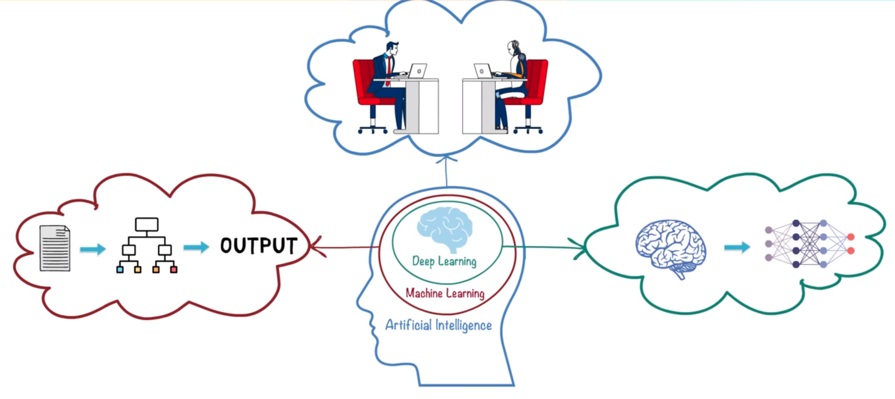
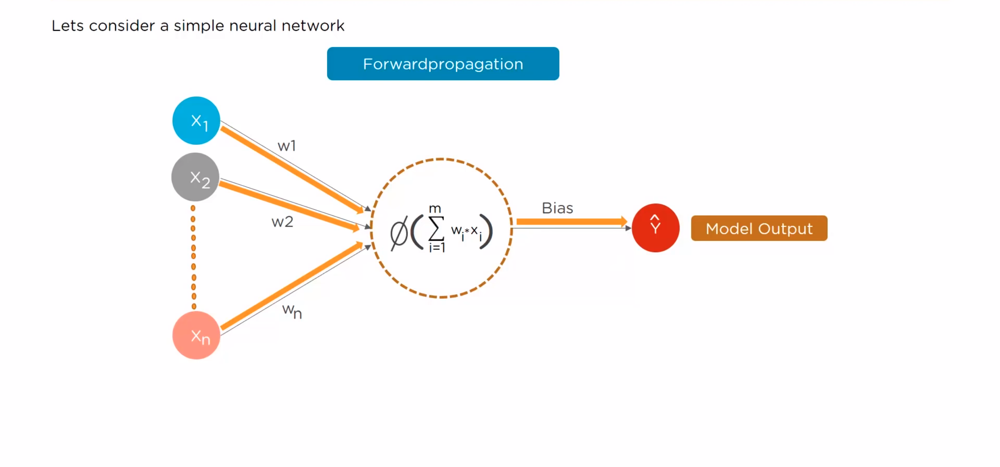
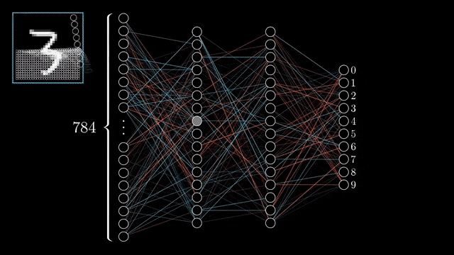
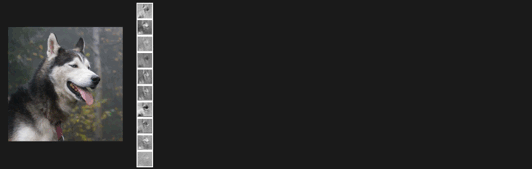
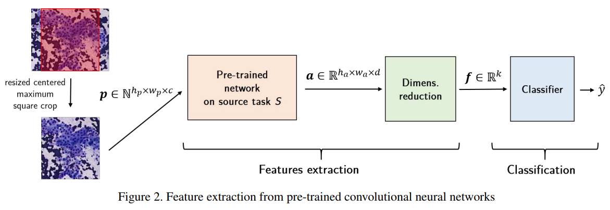
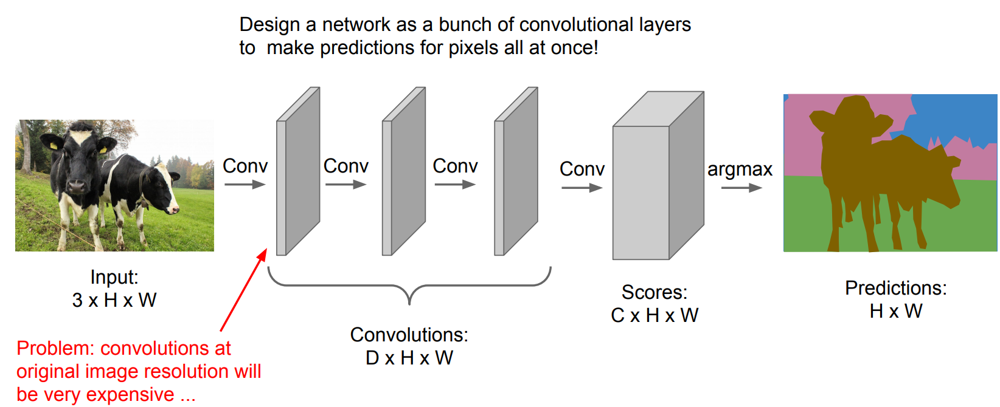

class: middle, center, title-slide

# Introduction to Artificial Intelligence

Lecture 2: Deep Learning

  
Kaleab A. Kinfu 
[kinfu@jhu.edu](mailto:kinfu@jhu.edu)
---

# Today 
- Introduction to neurons 
- Introduction to deep neural networks 
- Deep Learning training phases
- Convolutional neural networks 
- Classification
- Object detection
- Semantic segmentation

---

class: middle

# Deep learning

---

class: middle
# What is Deep Learning Learning 
 
.slide_left.width-110[]
---

class: middle

.center.width-100[]

.center[Deep Learning: Human brain as role model ]

---

class: middle

.center.width-100[]

.center[Deep Learning is based on a collection of connected units or nodes called artificial neurons, which loosely model the neurons in a biological brain.]

---
# What are neurons
Neurons are information messengers. They use electrical impulses and chemical signals to transmit information between different areas of the brain, and between the brain and the rest of the nervous system.
 
.slide_left.width-110[]

---
# Artificial Neural Network
An artificial neuron is a mathematical function conceived as a model of biological neurons, a neural network.
 
.slide_left.width-110[]
---

# Artificial Neural Network
An artificial neuron is a mathematical function conceived as a model of biological neurons, a neural network.
 
.slide_left.width-110[]
---

# Neural Network Computation
 
.slide_left.width-110[]
---

# Neural Network Computation
 
.slide_left.width-110[]
---

# Neural Network Computation
 
.slide_left.width-110[]
---

# Neural Network Computation
 
.slide_left.width-110[]
---

# Neural Network Computation
 
.slide_left.width-110[]
---

# Neural Network Computation
 
.slide_left.width-110[]
---

class: middle

.center[
.width-40[] &nbsp; &nbsp;
.width-40[]
]

.exercise[How would you write a computer program that recognizes cats from dogs using Artificial Neural Network?]

---

class: middle

.center.width-100[]

.center[The deep learning approach.]

---

class: middle, center, black-slide

<iframe width="600" height="450" src="https://www.youtube.com/embed/cNxadbrN_aI?rel=0" frameborder="0" allowfullscreen></iframe>

The Perceptron

---

# DL Example: Digit Recognition
 
.slide_left.width-110[]
---
class: middle, center, black-slide
# DL Example: Digit Recognition
 
.center.width-100[]

---
class: middle, center, black-slide
# DL Example: Digit Recognition
 
.center.width-100[]

---
class: middle, center, black-slide
# DL Example: Digit Recognition
 
.center.width-100[]

---
class: middle, center, black-slide
# DL Example: Digit Recognition
 
.center.width-100[]

---
class: middle, center, black-slide
# DL Example: Digit Recognition
 
.center.width-100[]

---

class: middle

# Convolutions

---

class: middle

.center.width-80[]

If they were handled as normal "unstructured" vectors, high-dimensional signals such as sound samples or images would require models of intractable size.

.footnote[Credits: Francois Fleuret, [EE559 Deep Learning](https://fleuret.org/ee559/), EPFL; Michael Bronstein, [Geometric Deep Learning](https://drive.google.com/file/d/14H8KXBpkJBlqINTLOTvlTRMh-WLkGo4-/view), 2020.]

---

class: middle

.center.width-80[]

Large signals have some "invariance in translation". A representation meaningful at a certain location **should be used everywhere**.

.footnote[Credits: Francois Fleuret, [EE559 Deep Learning](https://fleuret.org/ee559/), EPFL; Michael Bronstein, [Geometric Deep Learning](https://drive.google.com/file/d/14H8KXBpkJBlqINTLOTvlTRMh-WLkGo4-/view), 2020.]
---

# Convolutions

A convolution layer embodies this idea. It applies the same linear transformation locally everywhere while preserving the signal structure.

 
.center[]

.footnote[Credits: Francois Fleuret, [EE559 Deep Learning](https://fleuret.org/ee559/), EPFL.]

---

class: middle

.width-80.center[]

.caption[Some of the main computer vision tasks.  Each of them requires a different neural network architecture.]

.footnote[Credits: [Aurélien Géron](https://www.oreilly.com/content/introducing-capsule-networks/), 2018.]

---

class: middle

.center[]

.footnote[Credits: Francois Fleuret, [EE559 Deep Learning](https://fleuret.org/ee559/), EPFL.]

---

class: middle

# Convolutional networks

---

class: middle

A **convolutional network** is generically defined as a composition of convolutional layers ($\texttt{CONV}$), pooling layers ($\texttt{POOL}$), linear rectifiers ($\texttt{RELU}$) and fully connected layers ($\texttt{FC}$).

.center.width-100[]

---

class: center, middle, black-slide

.width-100[]

---
class: middle

# Computer Vision

---

class: middle

.center[
.width-70[]

Sheepdog or mop?
]

.footnote[Credits: [Karen Zack](https://twitter.com/teenybiscuit), 2016.]

---

class: middle

.center[
.width-70[]

Chihuahua or muffin?
]

.footnote[Credits: [Karen Zack](https://twitter.com/teenybiscuit). 2016.]

---

class: middle

The (human) brain is so good at interpreting visual information that the **gap** between raw
data and its semantic interpretation is difficult to assess intuitively:

 
.center[

This is a mushroom.
]

---

class: middle, center

.width-70[]

This is a mushroom.

---

class: middle, center

.width-30[] +
.width-30[] +
.width-30[]

This is a mushroom.

---

class: middle, center

.width-80[]

This is a mushroom.

---

class: middle, center

Writing a computer program that sees?

---

class: middle

.width-80.center[]

.caption[Some of the main computer vision tasks.  Each of them requires a different neural network architecture.]

.footnote[Credits: [Aurélien Géron](https://www.oreilly.com/content/introducing-capsule-networks/), 2018.]

---
class: middle

# Classification

A few tips when using convnets for classifying images.

---

class: middle

## Convolutional neural networks

- Convolutional neural networks combine convolution, pooling and fully connected layers.
- They achieve state-of-the-art results for **spatially structured** data, such as images, sound or text.

.center.width-110[]

.footnote[Credits: [Dive Into Deep Learning](https://d2l.ai/), 2020.]

---

class: middle

For classification,
- the activation in the output layer is a Softmax activation producing a vector $\mathbf{h} \in \bigtriangleup^C$ of probability estimates $P(Y=i|\mathbf{x})$, where $C$ is the number of classes;
- the loss function is the cross-entropy loss.

---

class: middle

## Image augmentation

The lack of data is the biggest limit to the performance of deep learning models.
- Collecting more data is usually expensive and laborious.
- Synthesizing data is complicated and may not represent the true distribution.
- **Augmenting** the data with base transformations is simple and efficient (e.g., as demonstrated with AlexNet).

---

class: middle

.center.width-100[]

.footnote[Credits: [DeepAugment](https://github.com/barisozmen/deepaugment), 2020.]

---

class: middle

.center.width-100[]

.footnote[Credits: [DeepAugment](https://github.com/barisozmen/deepaugment), 2020.]

---

class: middle

## Pre-trained models

- Training a model on natural images, from scratch, takes **days or weeks**.
- Many models trained on ImageNet are publicly available for download. These models can be used as *feature extractors* or for smart *initialization*.
- The models themselves should be considered as generic and re-usable assets.

---

class: middle

## Transfer learning

- Take a pre-trained network, remove the last layer(s) and then treat the rest of the network as a **fixed** feature extractor.
- Train a model from these features on a new task.
- Often better than handcrafted feature extraction for natural images, or better than training from data of the new task only.

 
.center.width-100[]

.footnote[Credits: Mormont et al, [Comparison of deep transfer learning strategies for digital pathology](http://hdl.handle.net/2268/222511), 2018.]

---

class: middle

.center.width-65[]

## Fine-tuning

- Same as for transfer learning, but also *fine-tune* the weights of the pre-trained network by continuing backpropagation.
- All or only some of the layers can be tuned.

.footnote[Credits: [Dive Into Deep Learning](https://d2l.ai/), 2020.]

---

class: middle

# Object detection

---

class: middle

The simplest strategy to move from image classification to object detection is to classify local regions, at multiple scales and locations.

.center.width-80[]

.footnote[Credits: Francois Fleuret, [EE559 Deep Learning](https://fleuret.org/ee559/), EPFL.]
---

--- 

# YOLO

.center.width-65[]

YOLO (You Only Look Once; Redmon et al, 2015) models detection as a regression problem. 

The image is divided into an $S\times S$ grid and for each grid cell predicts $B$ bounding boxes, confidence for those boxes, and $C$ class probabilities. These predictions are encoded as an $S \times S \times (5B + C)$ tensor.

.footnote[Credits: Redmon et al, 2015.]

---

class: middle, center, black-slide

<iframe width="600" height="450" src="https://www.youtube.com/embed/YmbhRxQkLMg?rel=0" frameborder="0" allowfullscreen></iframe>

Redmon, 2017.

---

class: middle

# Segmentation

---

class: middle

Semantic **segmentation** is the task of partitioning an image into regions of different semantic categories. 

These semantic regions label and predict objects at the pixel level.

.center.width-70[]

.footnote[Credits: [Dive Into Deep Learning](https://d2l.ai/), 2020.]

---

class: middle

.center.width-100[]

.footnote[Credits: [CS231n, Lecture 11](http://cs231n.stanford.edu/slides/2018/cs231n_2018_lecture11.pdf), 2018.]

---

class: middle

.center.width-100[]

.footnote[Credits: [CS231n, Lecture 11](http://cs231n.stanford.edu/slides/2018/cs231n_2018_lecture11.pdf), 2018.]

---

class: middle, center, black-slide

<iframe width="600" height="450" src="https://www.youtube.com/embed/OOT3UIXZztE?rel=0" frameborder="0" allowfullscreen></iframe>

---

class: middle

It is noteworthy that for detection and semantic segmentation, there is an heavy
re-use of large networks trained for classification.

.bold[The models themselves, as much as the source code of the algorithm that
produced them, or the training data, are generic and re-usable assets.]

.footnote[Credits: Francois Fleuret, [EE559 Deep Learning](https://fleuret.org/ee559/), EPFL.]

---

class: middle, center, black-slide

<iframe width="600" height="450" src="https://www.youtube.com/embed/Khuj4ASldmU?rel=0" frameborder="0" allowfullscreen></iframe>

Artistic style transfer (Ruder et al, 2016)

---

class: middle, center, black-slide

<iframe width="600" height="450" src="https://www.youtube.com/embed/kSLJriaOumA?rel=0" frameborder="0" allowfullscreen></iframe>

Image generation (Karras et al, 2018)

---

class: middle, center

.width-70[]

.italic["ACM named .bold[Yoshua Bengio], .bold[Geoffrey Hinton], and .bold[Yann LeCun] recipients of the .bold[2018 ACM A.M. Turing Award] for conceptual and engineering breakthroughs that have made deep neural networks a critical component of computing."]

---

class: middle

.center.circle.width-30[]

.italic[For the last forty years we have programmed computers; for the next forty years we will train them.]

.pull-right[Chris Bishop, 2020.]

---

class: middle

# Implementations

---

class: middle

.center[
.width-50[]

.width-50[]

.width-30[]
]

---

class: end-slide, center
count: false

The end.